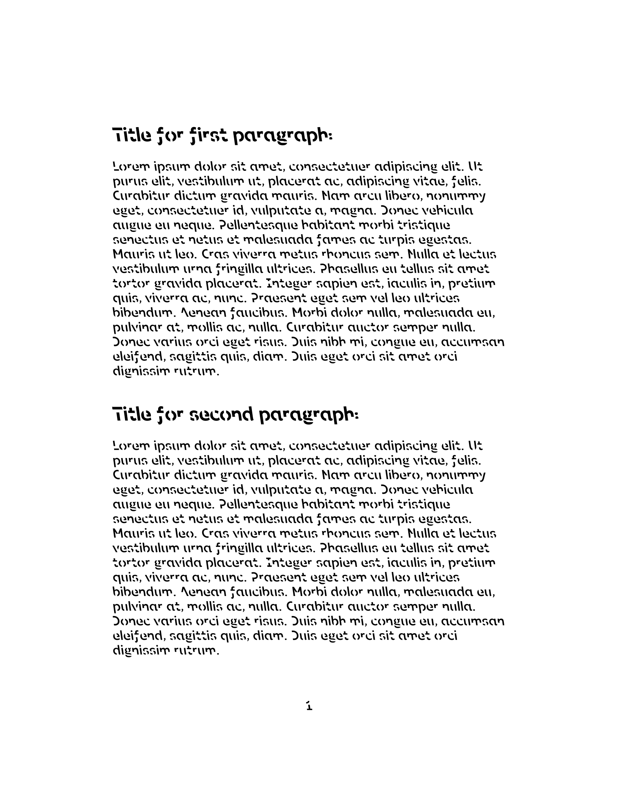
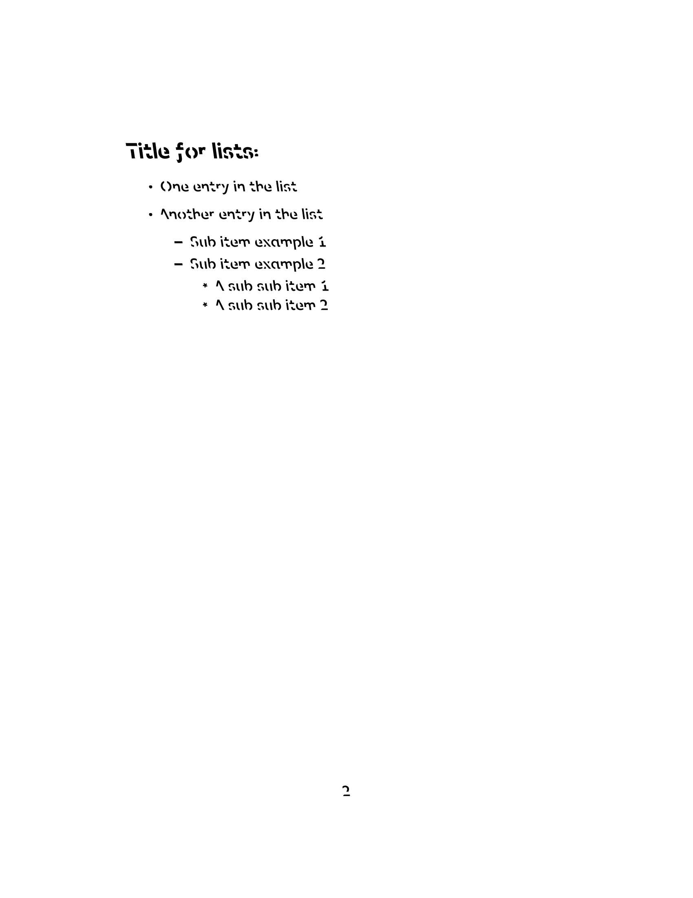
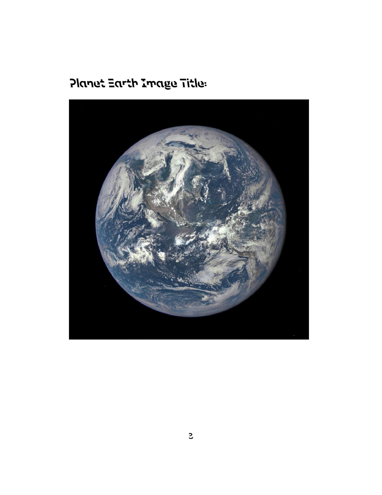

# Memorisation Document LaTeX Template:

- A basic document for things like revising for exams, making revision notes and generally remembering stuff.

- Makes use of Sans Forgetica font. This can be downloaded for free from: https://sansforgetica.rmit/ which utilises the license indicated at: https://creativecommons.org/licenses/by-nc/2.0/ the font (file `SansForgetica-Regular.otf`) has not been modified or built upon in anyway, merely only used to produce this document.

- `earth.png` image downloaded from NASA images: https://www.nasa.gov/image-feature/nasa-captures-epic-earth-image

- Tested and compiled using XeLaTeX.

# Preview of document:

## Page 1:

## Page 2:

## Page 3:
